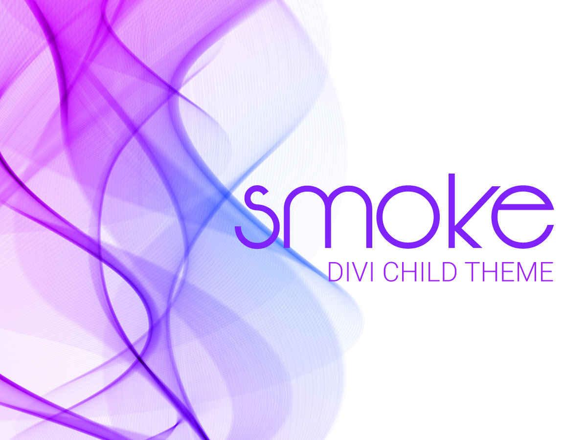
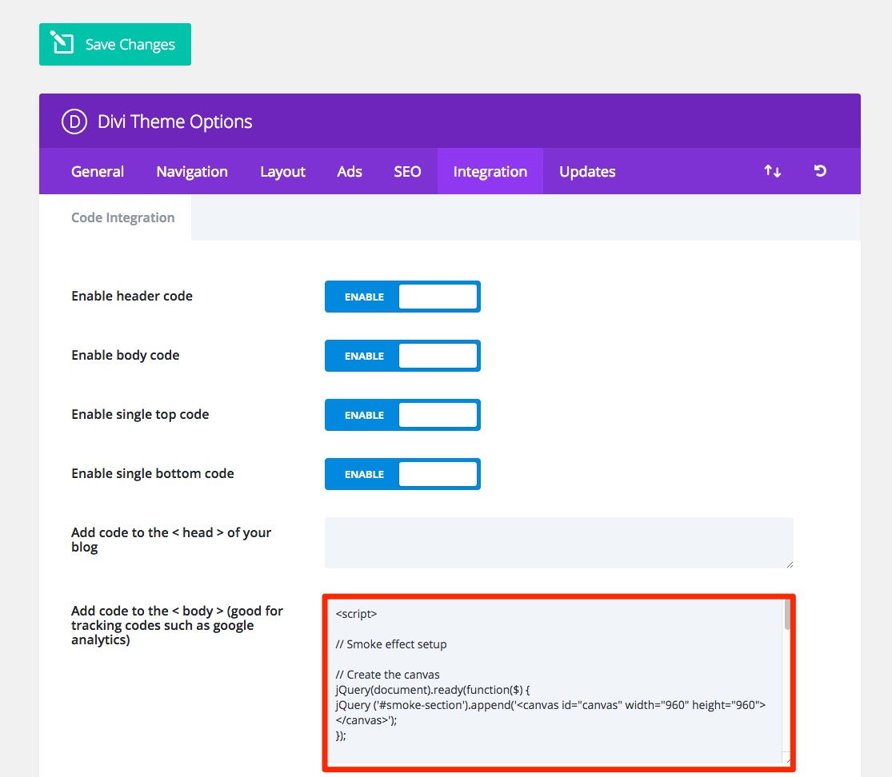

# Smoke Child Theme for Divi
Smoke is a blank Child Theme for Divi with Smoke Effect




## What's the smoke effect?
The smoke effect is inspired by and based on [smoke.js](https://github.com/bijection/smoke.js) with a little improvements to make it responsive. It adds a nice smoke effect wich is ideal for food websites.


## Features 

* Change the smoke color
* Change the smoke origin
* Control the smoke with your mouse
* Fully responsive

## How to use it?
* Download and Install your Child Theme
* Add the following code to your integrations TAB

```
<script>

// Smoke effect setup

// Create the canvas
jQuery(document).ready(function($) {
jQuery ('#smoke-section').append('<canvas id="canvas" width="960" height="960"></canvas>');
});


jQuery(document).ready(function($) { // Get the canvas width and height
	var canvas = document.getElementById('canvas')
	var ctx = canvas.getContext('2d')
	W = document.body.parentNode.clientWidth ;
	H = window.innerHeight;
	canvas.width = W ;
	canvas.height = H;

	var party = smokemachine(ctx, [255.1, 255.1, 255.1]) // Smoke color
	party.start() // start animating

	onmousemove = function (e) { // Make the smoke follow the mouse cursor
		var x = e.clientX
		var y = e.clientY/0.5
		var n = .5
		var t = Math.floor(Math.random() * 200) + 3000
		party.addsmoke(x, y, n, t)
	}

	window.onresize = function() { // Make the canvas responsive
   W = document.body.parentNode.clientWidth;
   H = window.innerHeight;
   canvas.width = W;
   canvas.height = H;
}

	setInterval(function(){
		party.addsmoke(document.body.parentNode.clientWidth/2, innerHeight, 1) // Smoke start position
	}, 100);

});


</script>
```


* Import the default layout "default-smoke-layout.json" from the folder layouts.

## How to contribute?

* Improve this documentation. My first language is Spanish, so if you improve this documentation it will be a big help.
* Translate this README file.
 
### On GitHub

- [Create a Fork] (https://github.com/alienmtnez/smoke-child-theme/fork)
- Add your changes
- Create a Pull Request

### Email me

[Send me an email](mailto:alien.mtnez@gmail.com)

## Change Log


## [0.1.0] - 2017-04-17

### Added
- Child Theme.
- Default Smoke Layout.

## License
GNU General Public License v3.0 Read [LICENSE.md](https://github.com/alienmtnez/smoke-child-theme/blob/master/LICENSE) for more information.
